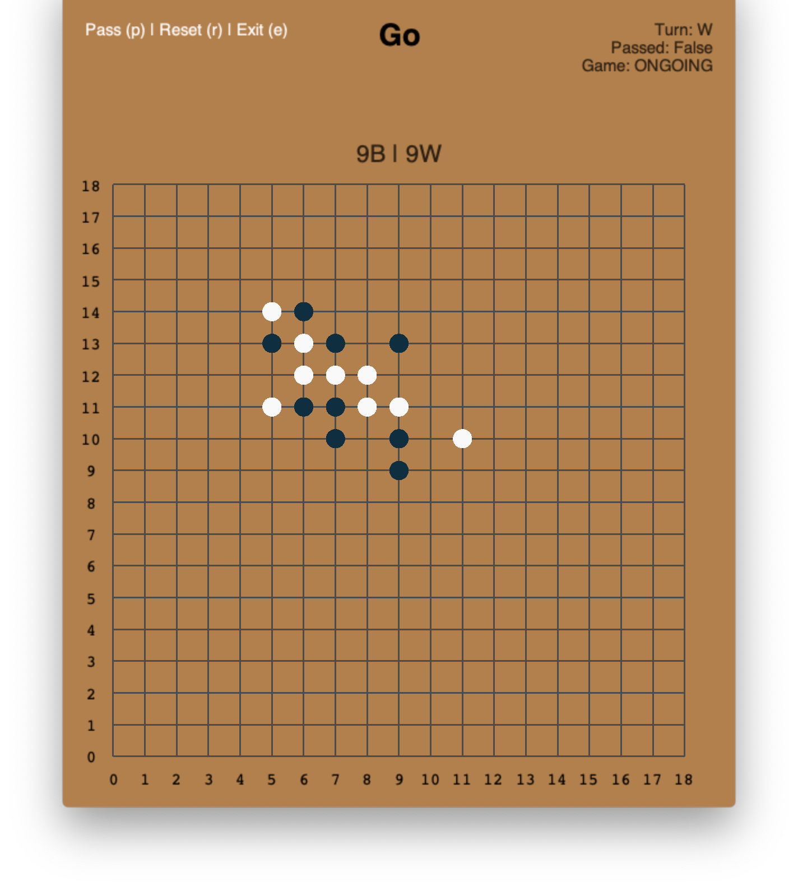

# About
An environment for the board game Go. It is implemented using OpenAI's Gym API. 
It is also optimized to be as efficient as possible in order to efficiently train ML models.

# Installation
```bash
# In the root directory
pip install -e .
```

# API

### Coding example
```python
import gym

go_env = gym.make('gym_go:go-v0', size=7, komi=0, reward_method='real')

first_action = (2,5)
second_action = (5,2)
state, reward, done, info = go_env.step(first_action)
go_env.render('terminal')
```

```
     0 1 2 3 4 5 6 
0    ╔═╤═╤═╤═╤═╤═╗
1    ╟─┼─┼─┼─┼─┼─╢
2    ╟─┼─┼─┼─┼─○─╢
3    ╟─┼─┼─┼─┼─┼─╢
4    ╟─┼─┼─┼─┼─┼─╢
5    ╟─┼─┼─┼─┼─┼─╢
6    ╚═╧═╧═╧═╧═╧═╝
     Turn: WHITE, Game State (ONGOING|PASSED|END): ONGOING
     Black Area: 49, White Area: 0
```

```python
state, reward, done, info = go_env.step(second_action)
go_env.render('terminal')
```

```
	0 1 2 3 4 5 6 
0	╔═╤═╤═╤═╤═╤═╗
1	╟─┼─┼─┼─┼─┼─╢
2	╟─┼─┼─┼─┼─○─╢
3	╟─┼─┼─┼─┼─┼─╢
4	╟─┼─┼─┼─┼─┼─╢
5	╟─┼─●─┼─┼─┼─╢
6	╚═╧═╧═╧═╧═╧═╝
	Turn: BLACK, Game State (ONGOING|PASSED|END): ONGOING
	Black Area: 1, White Area: 1
```

### UI example
```bash
# In the root directory.
# Defaults to a uniform random AI opponent.
python3 demo.py
```


### High level API
[GoEnv](gym_go/envs/go_env.py) defines the Gym environment for Go. 
It contains the highest level API for basic Go usage.  

### Low level API
[GoGame](gym_go/gogame.py) is the set of low-level functions that defines all the game logic of Go.
`GoEnv`'s high level API is built on `GoGame`.
These sets of functions are intended for a more detailed and finetuned 
usage of Go.

# Scoring
We use Trump Taylor scoring, a simple area scoring, to determine the winner. A player's _area_ is defined as the number of empty points a 
player's pieces surround plus the number of player's pieces on the board. The _winner_ is the player with the larger 
area (a game is tied if both players have an equal amount of area on the board).

There is also support for `komi`, a bias score constant to balance the advantage of black going first. 
By default `komi` is set to 0.

# Game ending
A game ends when both players pass consecutively

# Reward methods
Reward methods are in _black_'s perspective
* **Real**:
  * If game ended:
    * `-1` - White won
    * `0` - Game is tied
    * `1` - Black won
  * `0` - Otherwise
* **Heuristic**: If the game is ongoing, the reward is `black area - white area`. 
If black won, the reward is `BOARD_SIZE**2`. 
If white won, the reward is `-BOARD_SIZE**2`.
If tied, the reward is `0`.

# State
The `state` object that is returned by the `reset` and `step` functions of the environment is a 
`6 x BOARD_SIZE x BOARD_SIZE` numpy array. All values in the array are either `0` or `1` 
* **First and second channel:** represent the black and white pieces respectively.
* **Third channel:** Indicator layer for whose turn it is 
* **Fourth channel:** Invalid moves (including ko-protection) for the next action
* **Fifth channel:** Indicator layer for whether the previous move was a pass
* **Sixth channel:** Indicator layer for whether the game is over

# Action
The `step` function takes in the action to execute and can be in the following forms:
* a tuple/list of 2 integers representing the row and column or `None` for passing
* a single integer representing the action in 1d space (i.e 9 would be (1,2) and 49 would be a pass for a 7x7 board)
